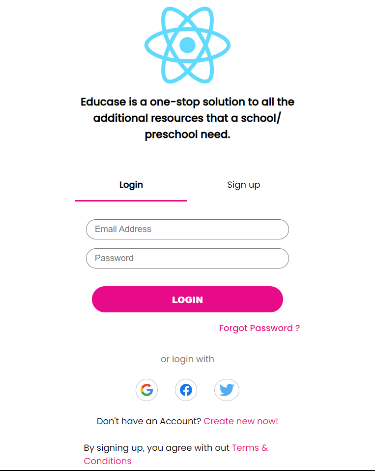

# Educase Assignment UI
UI for Signup/ Login form

## Live Link
Access this [webApp](https://educase-assignment-ui.netlify.app)

## Table of Context:

-[About the App](#about-the-app)

-[Screentshot](#screenshot)

-[Technologies](#technologies)

-[Setup](#setup)

-[Status](#status)

## About the App
Educase signup/sign app is assignment app made with React, HTML and custom CSS

## Screenshot

## Technologies
HTML, CSS, JS, React & `Icones` for the icons

## Setup
- download or clone the repository
- run `npm install`

## Status
Completed
